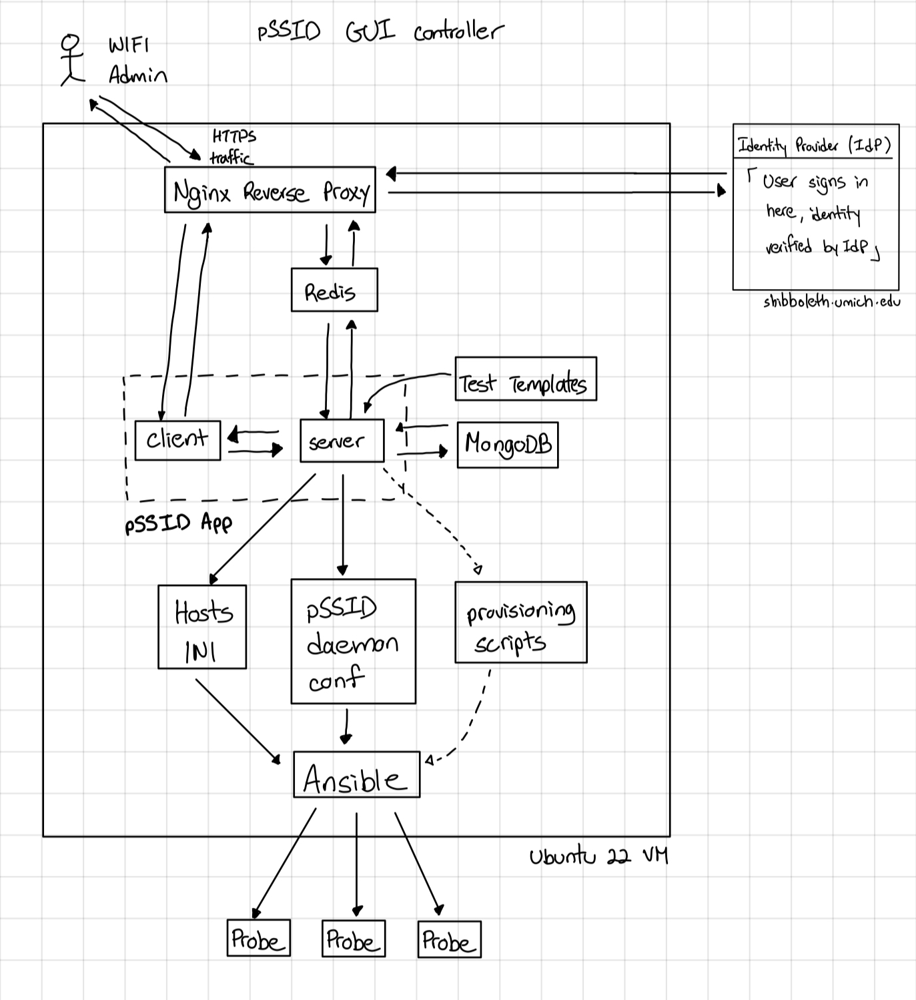
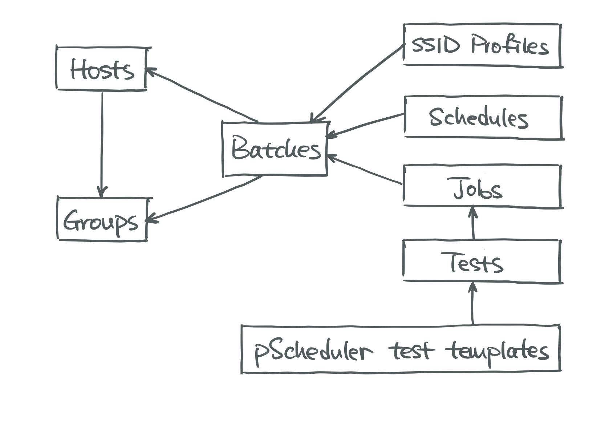

# pSSID GUI

pSSID GUI is a web application for building and managing pSSID configuration
through a browser. You define hosts, host groups, schedules, SSID profiles,
tests, jobs, and batches, and the application produces the files the pSSID daemon
needs, ready for a provision script to deliver to your probes.

The same codebase can be themed for different organizations, and the included
installer brings the stack up in one step while keeping the existing security
model: HTTPS, optional single sign-on, and an isolated Docker network.

## Quickstart: one command

On a fresh Unix box, as root:

```bash
curl -fsSL https://raw.githubusercontent.com/UMNET-perfSONAR/pssid-gui2/main/bootstrap.sh | bash
```

That single command installs git and Ansible, fetches the application,
installs Docker, generates the secrets and certificates, builds and starts the
stack, loads the reusable starter defaults, and schedules nightly database
backups. When it finishes, open `https://<this machine's hostname>`.

Settings ride along as environment variables (all optional):

```bash
curl -fsSL https://raw.githubusercontent.com/UMNET-perfSONAR/pssid-gui2/main/bootstrap.sh \
  | PSSID_HOSTNAME=pssid.example.edu bash
```

`bootstrap.sh` documents the full list (TLS mode, Let's Encrypt email, SSO and
its OIDC values). From a clone, `./bootstrap.sh` does the same thing.

On a VM with a small disk, add `PSSID_PULL=true` to pull the prebuilt images
from the registry instead of building them (~4 GB of Docker storage instead of
~8-10 GB); see the
[deployment guide](docs/deployment.md#small-vms-pull-prebuilt-images-instead-of-building).
The bootstrap also recognizes a dedicated local filesystem mounted at
`/var/lib/docker` and places containerd on that same volume automatically.
Network filesystems such as NFS are not supported for container storage.

Afterwards, one command each keeps the deployment maintained:

```bash
make upgrade    # backup, pull the latest release, rebuild, verify health
make backup     # extra on-demand database backup (nightly ones are automatic)
make help       # every operator shortcut (up, down, logs, doctor, ...)
```

## The same steps, by hand

The automation only strings together the stages below. Run them yourself when
you want control at each point, or when something needs investigating; the
[deployment guide](docs/deployment.md) covers every stage in depth and is
written for the Unix sysadmin and WiFi engineer who has to intervene when the
automation cannot.

1. **Prerequisites** (root shell):
   ```bash
   apt-get update && apt-get install -y git ansible
   ```
2. **Fetch the source**:
   ```bash
   git clone https://github.com/UMNET-perfSONAR/pssid-gui2.git /opt/pssid-gui
   ```
3. **Deploy**. Either the playbook (installs Docker for you; the
   [Ansible guide](ansible/README.md) covers remote hosts, SSO, editions,
   upgrades, and backups):
   ```bash
   cd /opt/pssid-gui/ansible
   ansible-playbook site.yml -e pssid_gui_hostname=pssid.example.edu
   ```
   or, when Docker is already installed, the interactive installer, which asks
   for the edition, hostname, SSO, and TLS settings and can also run without
   prompts:
   ```bash
   ./install.sh
   ./install.sh -y --edition=default --hostname=pssid.example.com --tls=self-signed --sso=false
   ```
4. **Verify**:
   ```bash
   curl -k https://localhost/api/health    # {"status":"ok",...}
   make ps                                 # container status
   ```
5. **Optional starter data** (the playbook already does this on first install):
   ```bash
   make seed-defaults
   ```

Day-to-day operations are wrapped in the Makefile (`make up`, `make down`,
`make logs`, `make dev`, `make doctor`, and others). Run `make help` for the
full list.

## Starter data

Two seeders ship with the project, and they are **additive**: the pre-load
establishes the baseline and the QA dataset layers on top without disturbing it.

- `make seed-defaults` ([`scripts/seed-defaults.sh`](scripts/seed-defaults.sh))
  is the main one: it loads the pre-load starter data for a fresh site — the
  standard schedules, the eduroam profile, the google http/rtt tests,
  `job-comprehensive`, and the `all` host group (regex `.*`). No batches or
  hosts. The installer runs this once on first install, and it can also be run
  by hand.
- `make seed-qa` ([`scripts/seed-qa.sh`](scripts/seed-qa.sh)) is for testing: it
  adds the MWireless profile, five more tests, four more jobs, three batches at
  different priorities, four probes carrying per-host metadata, and the `rpi4`
  group (metadata `ifacename=wlan0`). Between them these exercise every batch
  and metadata assignment path. Override the probe names with
  `PSSID_QA_PROBE1`…`4`. The [QA walkthrough](docs/QA.md) has the full
  procedure and the expected output.

## Documentation

The [deployment guide](docs/deployment.md) covers installation, single sign-on
(with an Okta example), TLS, editions, and the provisioning pipeline. The
[Ansible guide](ansible/README.md) covers the role-based deployment.

## System overview

The application runs as a set of Docker containers: `client`, `server`, `mongo`,
and `nginx`, plus `redis` for session storage and `certbot` for certificate
renewal when single sign-on is enabled.

Users interact with the client in the browser. The client talks to the server,
which stores its data in MongoDB. nginx terminates HTTPS and routes traffic into
the internal Docker network, so the internal services are not exposed directly.

<p align="center">
  
</p>

The application produces two files:

- `hosts.ini`, an Ansible inventory of the hosts and groups.
- `pssid_config.json`, the pSSID daemon configuration, which lists the batches to
  run.

You build these in the GUI and write them to the controller with **Settings >
Configuration > Generate**, which validates them against the daemon's rules
first. A provision script (`bin/provision`) then uses Ansible to copy the daemon
config onto the probes in `hosts.ini` and restart the daemon on each one; the
copy shipped in this repository is a placeholder that only logs, so a deployment
supplies its own. The deployment guide describes the
[full pipeline](docs/deployment.md#provisioning-and-automation).

## Configuration file anatomy

The daemon configuration is built from seven components, each with its own page
in the dashboard: hosts, host groups, schedules, SSID profiles, tests, jobs, and
batches. Test templates on disk define the fields each test type needs. Tests are
combined into jobs, and SSID profiles, schedules, and jobs are combined into
batches. The batches are what run on the probes.

<p align="center">
  
</p>

## Access control

Access is configured in [`shared/config.ts`](shared/config.ts). With single
sign-on enabled, users sign in through an OIDC provider, and group membership maps
to read or write access in
[`shared/auth-groups.config.json`](shared/auth-groups.config.json). With SSO
disabled, access is open, and `OPEN_WRITE` decides whether unauthenticated users
have read-only or read-write access. The installer sets these values; the
[deployment guide](docs/deployment.md#single-sign-on) covers provider-specific
setup.

## Further reading

- [Adding fields to the config file](services/README.md)
- [Backend folders](services/server/src/README.md),
  [service files](services/server/src/services/README.md), and
  [test templates](services/server/README.md)
- [Frontend directories](services/client/src/README.md) and
  [components](services/client/src/components/README.md)

## Testing

```bash
make test     # all unit tests (config generation contract, validators)
make smoke    # every user action, end to end, against a running stack
```

Both are wired into CI; the [deployment guide](docs/deployment.md#everyday-operations)
describes what each covers.

## Troubleshooting

```bash
make doctor                          # prerequisites and port conflicts
make ps                              # container status
make logs                            # service logs
curl -k https://<host>/api/health    # server and database health
```

The [deployment guide](docs/deployment.md#troubleshooting) has more.
