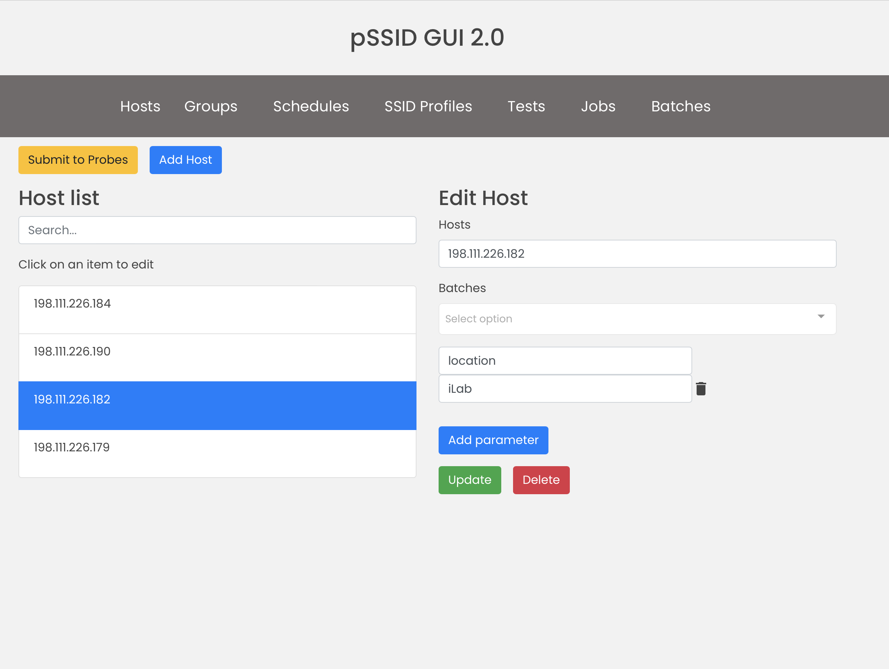

# pssid-gui2

Version 2.0 of the pSSID-GUI Web Application.

The pSSID GUI is a web application for generating and managing pSSID configuration files through a graphical interface. It helps users define hosts, host groups, schedules, SSID profiles, tests, jobs, and batches, then outputs the files needed by pSSID provisioning scripts.

---

## Table of Contents

* [System Overview](#system-overview)
* [Output pSSID Daemon Config File](#output-pssid-daemon-config-file)
* [Provisioning Probes](#provisioning-probes)
* [Prerequisites](#prerequisites)
* [Installing Docker on Ubuntu](#installing-docker-on-ubuntu)
* [Published Docker Images](#published-docker-images)
* [Fresh VM Deployment Guide](#fresh-vm-deployment-guide)
* [Running from Source](#running-from-source)
* [Configuring Single Sign-On and User Permissions](#configuring-single-sign-on-and-user-permissions)
* [Important README Links in this Repository](#important-readme-links-in-this-repository)
* [Troubleshooting](#troubleshooting)

---

## System Overview

The core application is containerized using Docker. Depending on the deployment mode, the application may include the following containers:

* `client`
* `server`
* `mongo`
* `nginx`
* `redis` optional, used for SSO/session storage
* `certbot` optional, used for certificate renewal in production certificate setups

Users interact with the frontend client through the browser. The client communicates with the backend server, and the backend server stores application data in MongoDB.

Nginx routes HTTPS traffic into the internal Docker network. It allows users to access the frontend client and selected backend API routes while keeping internal services isolated from direct public access.

<p align="center">
  
</p>

The web application outputs two important files:

* `hosts.ini`
* `pssid_conf.json`

`hosts.ini` is an Ansible inventory containing the list of hosts and groups defined through the GUI.

`pssid_conf.json` is the pSSID daemon configuration file. It contains the batches that should be scheduled and run.

The provisioning scripts use Ansible to copy the daemon configuration file onto the probes defined in `hosts.ini`. The pSSID daemon on each probe then runs according to the generated configuration.

---

## Output pSSID Daemon Config File

The output configuration file is broken into seven major components:

1. Hosts
2. Host groups
3. Schedules
4. SSID profiles
5. Tests
6. Jobs
7. Batches

Each component corresponds to a page in the GUI dashboard.

<p align="center">
  
</p>

At a high level, template files on disk define what fields are required for each test type. These tests are then used to define jobs. Finally, SSID profiles, schedules, and jobs are combined into batches. Batches are what actually run on the probes.

---

## Provisioning Probes

The Hosts and Groups pages each include a **Configure selected host** / **Configure selected group** button. The button is only active when a host or group is selected in the list. Clicking it triggers the following sequence on the server:

1. **Generate inventory file** (`hosts.ini`) — all hosts and host groups currently in MongoDB are written to `hosts.ini` in Ansible INI format. Groups include their member hostnames and any regex patterns.

2. **Generate daemon config file** (`pssid_config.json`) — all collections (hosts, host groups, schedules, SSID profiles, tests, jobs, batches) are read from MongoDB and merged into a single JSON document. Test spec fields are normalized before writing. Before writing, any layer 2, layer 3, or general script selections on batches are re-validated against the scripts currently on disk; stale or invalid values are cleared and a warning is logged.

3. **Call the provision script** — the server calls `bin/provision` as a subprocess with two positional arguments:

   ```
   bin/provision <context> <name>
   ```

   * `<context>` is either `host` or `host_groups`, depending on which page the button was clicked from.
   * `<name>` is the name of the selected host or group. If no specific item was selected (fallback), `*` is used.

   The script call and its arguments are logged to the server console before execution. On completion or error, the result is also logged.

The output files are written to the directory configured in `services/server/paths_config.json` under `output_directory`. By default this is `./output/` inside the server container, which is bind-mounted to `/var/lib/pssid/output/` on the host in the production Docker Compose setup.

The provision script (`bin/provision`) is responsible for using these files to push configuration to the probes via Ansible. Rayan's workflow is:

1. Use the GUI to define hosts, groups, schedules, tests, jobs, and batches.
2. Select a host or group and click **Configure selected host** / **Configure selected group**.
3. The GUI generates `hosts.ini` and `pssid_config.json` and calls `bin/provision`.
4. `bin/provision` uses Ansible to copy the config to the probe(s) and restart the pSSID daemon.

---

## Graphical User Interface

The web application has seven main tabs, one for each component of the configuration file.

Each tab supports create, read, update, and delete operations.

Each tab includes:

* A list of current objects in the MongoDB collection
* A regex search bar for filtering objects
* An add-object form
* An edit/delete form that appears after selecting an existing object

<p align="center">
  
</p>

---

## Prerequisites

Before deploying on a fresh VM, make sure you have:

* Ubuntu VM
* `sudo` access
* Internet access from the VM
* Docker installed
* Access to the deployment playbook repository

The recommended fresh VM deployment uses this repository:

```text
https://github.com/UMNET-perfSONAR/ansible-playbook-pssid-GUI-deploy.git
```

---

## Installing Docker on Ubuntu

Follow the official Docker installation approach for Ubuntu.

First, move to the home directory:

```bash
cd ~
```

Remove old or conflicting Docker packages:

```bash
for pkg in docker.io docker-doc docker-compose docker-compose-v2 podman-docker containerd runc; do
  sudo apt-get remove $pkg
done
```

Add Docker’s official GPG key:

```bash
sudo apt-get update
sudo apt-get install -y ca-certificates curl

sudo install -m 0755 -d /etc/apt/keyrings

sudo curl -fsSL https://download.docker.com/linux/ubuntu/gpg \
  -o /etc/apt/keyrings/docker.asc

sudo chmod a+r /etc/apt/keyrings/docker.asc
```

Add the Docker repository to Apt sources:

```bash
echo \
  "deb [arch=$(dpkg --print-architecture) signed-by=/etc/apt/keyrings/docker.asc] https://download.docker.com/linux/ubuntu \
  $(. /etc/os-release && echo "${UBUNTU_CODENAME:-$VERSION_CODENAME}") stable" | \
  sudo tee /etc/apt/sources.list.d/docker.list > /dev/null

sudo apt-get update
```

Install Docker:

```bash
sudo apt-get install -y docker-ce docker-ce-cli containerd.io docker-buildx-plugin docker-compose-plugin
```

Enable and start Docker:

```bash
sudo systemctl enable --now docker
```

Add your user to the Docker group:

```bash
sudo usermod -aG docker ${USER}
newgrp docker
```

Verify Docker works:

```bash
sudo docker run hello-world
```

---

## Published Docker Images

The official Docker Hub images are published under the `umnetworking` organization.
Use the release tag instead of `latest` for repeatable deployments.

```
umnetworking/pssid-gui2_client:v3.2.0
umnetworking/pssid-gui2_server:v3.2.0
umnetworking/pssid-gui2_mongo:v3.2.0
```

For an image-based deployment, copy `shared/` to the deployment host and mount it
into both the client and server containers. Do not mount `node_modules` volumes when
using the published images, because those volumes can hide the dependencies already
installed in the image.

If the Docker Hub repositories are private, run `docker login` on the deployment
host before pulling the images. For SSO deployments, `/usr/lib/pssid/server.env`
must provide the OIDC values used by the server, including `ISSUER_BASE_URL`,
`BASE_URL`, `CLIENT_ID`, `CLIENT_SECRET`, and `SECRET`.

---

# Fresh VM Deployment Guide

This section walks through deploying the pSSID GUI on a fresh Ubuntu VM using Ansible, Docker, Docker Compose, MongoDB, nginx, and a self-signed SSL certificate.

---

## Step 1 — Install Ansible

```bash
sudo apt-get update -y
sudo apt-get install -y ansible
ansible --version
```

Confirm that Ansible installed successfully.

---

## Step 2 — Clone the Deployment Playbook

```bash
cd ~
git clone https://github.com/UMNET-perfSONAR/ansible-playbook-pssid-GUI-deploy.git
cd ansible-playbook-pssid-GUI-deploy
```

---

## Step 3 — Verify Ansible Can Connect Locally and Become Root

Run:

```bash
ansible localhost -m ping --become --become-user root --become-method sudo -c local -K
```

You should see output containing:

```json
"ping": "pong"
```

If `sudo` requires a password, the `-K` flag will prompt for it.

---

## Step 4 — Install Required Ansible Galaxy Roles

```bash
ansible-galaxy install -r requirements.yml
```

---

## Step 5 — Set Up Variables

Run the defaults script using `bash`:

```bash
bash defaults.sh
```

Important: use `bash`, not `sh`. The script uses `==`, which is supported by `bash` but not by Ubuntu’s default `sh` shell.

Verify that the variable files were created:

```bash
ls inventory/group_vars/pssid-gui-controller/
```

You should see both `.yml` files.

---

## Step 6 — Check the Inventory File

View the inventory file:

```bash
cat inventory/hosts.ini
```

It should contain:

```ini
[pssid-gui-controller]
localhost ansible_connection=local
```

If it does not, edit it:

```bash
nano inventory/hosts.ini
```

Add:

```ini
[pssid-gui-controller]
localhost ansible_connection=local
```

Save and exit:

```text
Ctrl + O
Enter
Ctrl + X
```

---

## Step 6b — Clear Existing Docker Containers

This step is useful on a fresh VM to make sure all required ports are free.

Check existing containers:

```bash
docker ps -a
```

Stop all containers:

```bash
docker stop $(docker ps -aq)
```

Remove all containers:

```bash
docker rm $(docker ps -aq)
```

If there are no containers, Docker may print a message saying that no container IDs were provided. That is okay.

---

## Step 7 — Run the Ansible Playbook

From inside the deployment playbook directory, run:

```bash
ansible-playbook \
  --inventory inventory/hosts.ini \
  --become \
  --become-method sudo \
  --become-user root \
  --ask-become-pass \
  playbook.yml
```

Enter your `sudo` password when prompted.

A successful run should end with something similar to:

```text
localhost : ok=12 changed=5 unreachable=0 failed=0
```

The exact `ok` and `changed` numbers may vary slightly, but `failed=0` is the most important part.

---

## Step 8 — Fix Docker Permissions

Add your current user to the Docker group:

```bash
sudo usermod -aG docker ${USER}
newgrp docker
```

Verify that Docker can be used without `sudo`:

```bash
docker ps
```

You should see three running containers:

```text
pssid-client-1
pssid-server-1
pssid-mongo-1
```

---

## Step 9 — Generate a Self-Signed SSL Certificate

Replace `your-hostname.example.com` with your VM’s actual hostname.

Create the SSL directory:

```bash
sudo mkdir -p /usr/lib/pssid/ssl
```

Generate the certificate and private key:

```bash
sudo openssl req -x509 -nodes -days 365 -newkey rsa:2048 \
  -keyout /usr/lib/pssid/ssl/key.pem \
  -out /usr/lib/pssid/ssl/cert.pem \
  -subj "/CN=your-hostname.example.com"
```

Example:

```bash
sudo openssl req -x509 -nodes -days 365 -newkey rsa:2048 \
  -keyout /usr/lib/pssid/ssl/key.pem \
  -out /usr/lib/pssid/ssl/cert.pem \
  -subj "/CN=pssid-gui.example.edu"
```

---

## Step 10 — Create the nginx Configuration

Replace `your-hostname.example.com` with your actual hostname.

```bash
sudo tee /usr/lib/pssid/nginx.conf <<'EOF'
server {
    listen 443 ssl;
    server_name your-hostname.example.com;

    ssl_certificate /etc/ssl/pssid/cert.pem;
    ssl_certificate_key /etc/ssl/pssid/key.pem;

    location /api/ {
        proxy_pass http://server:8000/api/;
        proxy_set_header Host $host;
        proxy_set_header X-Real-IP $remote_addr;
    }

    location / {
        proxy_pass http://client:8080/;
        proxy_http_version 1.1;
        proxy_set_header Upgrade $http_upgrade;
        proxy_set_header Connection 'upgrade';
        proxy_set_header Host $host;
    }
}
EOF
```

Verify the file:

```bash
cat /usr/lib/pssid/nginx.conf
```

---

## Step 11 — Update `docker-compose.yml`

Open the Docker Compose file:

```bash
sudo nano /usr/lib/pssid/docker-compose.yml
```

Replace the entire contents with:

```yaml
services:
  client:
    image: umnetworking/pssid-gui2_client:v3.2.0
    volumes:
      - /usr/lib/pssid/shared:/usr/src/app/client/src/shared:ro
    ports:
      - 8080:8080

  server:
    image: umnetworking/pssid-gui2_server:v3.2.0
    restart: on-failure
    env_file:
      - /usr/lib/pssid/server.env
    environment:
      - REDIS_URL=redis://redis:6379
    volumes:
      - /usr/lib/exec/pssid/bin:/usr/src/app/server/bin
      - /var/lib/pssid/plugins:/usr/src/app/server/plugins
      - /var/lib/pssid/output:/usr/src/app/server/output
      - /usr/lib/pssid/shared:/usr/src/app/server/src/shared:ro
    ports:
      - 8000:8000
    depends_on:
      - mongo
      - redis

  mongo:
    image: umnetworking/pssid-gui2_mongo:v3.2.0
    ports:
      - 27017:27017
    volumes:
      - mongo_db:/data/db

  redis:
    image: redis:7
    restart: unless-stopped
    volumes:
      - redis_data:/data

  nginx:
    image: nginx:alpine
    ports:
      - 443:443
    volumes:
      - /usr/lib/pssid/nginx.conf:/etc/nginx/conf.d/default.conf
      - /usr/lib/pssid/ssl:/etc/ssl/pssid
    depends_on:
      - client
      - server

volumes:
  mongo_db:
  redis_data:
```

Save and exit:

```text
Ctrl + O
Enter
Ctrl + X
```

---

## Step 12 — Restart Containers

Move into the pSSID deployment directory:

```bash
cd /usr/lib/pssid
```

Stop the current containers:

```bash
sudo docker compose down
```

Start the updated deployment:

```bash
sudo docker compose up -d
```

Check running containers:

```bash
docker ps
```

You should now see four running containers:

```text
pssid-client-1
pssid-server-1
pssid-mongo-1
pssid-nginx-1
```

---

## Step 13 — Allow Port 443 Through the Firewall

Allow SSH first so you do not accidentally lock yourself out:

```bash
sudo ufw allow 22/tcp
```

Allow HTTPS:

```bash
sudo ufw allow 443/tcp
```

Enable the firewall:

```bash
sudo ufw enable
```

Check firewall status:

```bash
sudo ufw status
```

You should see rules allowing both `22/tcp` and `443/tcp`.

---

## Step 14 — Open the pSSID GUI in the Browser

Open:

```text
https://your-hostname.example.com
```

Replace `your-hostname.example.com` with your VM’s actual hostname.

Because this deployment uses a self-signed SSL certificate, your browser will show a certificate warning.

Click:

```text
Advanced → Proceed
```

The pSSID GUI should load.

---

# Running from Source

Clone this repository on the VM or development machine.

You may need `sudo` access to run Docker Compose depending on your Docker permissions.

There are two ways to run the application from source.

---

## With Single Sign-On

Make sure to read [Configuring Single Sign-On and User Permissions](#configuring-single-sign-on-and-user-permissions) before using this mode.

```bash
docker-compose --profile sso -f docker-compose.yml up -d
```

This runs a Redis container in addition to the rest of the application.

Make sure `ENABLE_SSO` is set to `true`.

---

## Without Single Sign-On

```bash
docker-compose -f docker-compose.yml up -d
```

This runs the application without a Redis container.

Make sure `ENABLE_SSO` is set to `false`.

---

# Configuring Single Sign-On and User Permissions

In:

```text
~/pssid-gui2/shared
```

there are two files used to configure authentication settings:

* `config.ts`
* `auth-groups.config.json`

---

## `config.ts`

Relevant fields:

```text
ENABLE_SSO
OPEN_WRITE
```

`ENABLE_SSO` controls whether users must log in through an identity provider.

Set:

```text
ENABLE_SSO=true
```

to require users to log in through an identity provider.

Set:

```text
ENABLE_SSO=false
```

to allow the application to run without login.

`OPEN_WRITE` is used when `ENABLE_SSO` is set to `false`.

Set:

```text
OPEN_WRITE=true
```

to allow any user to have write access.

Set:

```text
OPEN_WRITE=false
```

to give unauthenticated users read-only access.

---

## `auth-groups.config.json`

The `permissions` field contains the list of groups that have read or write permissions in the application.

Update this file to add, remove, or modify which groups have access to which permission level.

---

# Important README Links in this Repository

## General

* [Steps to add fields to config file](https://github.com/UMNET-perfSONAR/pssid-gui2/blob/main/services/README.md)
* [Ideas for future improvement](https://github.com/UMNET-perfSONAR/pssid-gui2/tree/main/services/client)

## Backend

* [About Test Template Files](services/server/README.md)
* [About the Backend Folders](https://github.com/UMNET-perfSONAR/pssid-gui2/tree/main/services/server/src/README.md)
* [About Each Service File - In Server](https://github.com/UMNET-perfSONAR/pssid-gui2/tree/main/services/server/src/services/README.md)

## Frontend

* [About Each Frontend Directory](https://github.com/UMNET-perfSONAR/pssid-gui2/blob/main/services/client/src/README.md)
* [About Each Client Component](https://github.com/UMNET-perfSONAR/pssid-gui2/blob/main/services/client/src/components/README.md)

---

# Troubleshooting

## Check Running Containers

```bash
docker ps
```

For the fresh VM deployment, the expected containers are:

```text
pssid-client-1
pssid-server-1
pssid-mongo-1
pssid-nginx-1
```

For the source-based deployment, container names may look like:

```text
pssid-gui2_server_1
pssid-gui2_mongo_1
pssid-gui2_client_1
pssid-gui2_nginx_1
pssid-gui2_certbot_1
redis
```

Redis is optional and only appears when SSO is enabled.

---

## Check Container Logs

Client logs:

```bash
docker logs pssid-client-1
```

Server logs:

```bash
docker logs pssid-server-1
```

Mongo logs:

```bash
docker logs pssid-mongo-1
```

nginx logs:

```bash
docker logs pssid-nginx-1
```

If your containers use the source-based names, replace the container name with the name shown in:

```bash
docker ps
```

---

## Check Whether Ports Are Already in Use

```bash
sudo ss -tulpn | grep -E ':443|:8080|:8000|:27017'
```

If a required port is already being used by another process or container, stop that service before restarting the pSSID containers.

---

## Restart the Fresh VM Deployment

```bash
cd /usr/lib/pssid
sudo docker compose down
sudo docker compose up -d
docker ps
```

---

## Stop Lingering Containers

Check containers:

```bash
docker ps
```

Stop a specific lingering container:

```bash
docker stop <container ID or name>
```

Stop all containers:

```bash
docker stop $(docker ps -aq)
```

Remove all stopped containers:

```bash
docker rm $(docker ps -aq)
```

---

## Free Docker Resources

Use this carefully because it removes unused Docker images, containers, networks, and build cache.

```bash
sudo docker system prune -af
```

---

## Deprecated Restart Script

Some older deployments may include an `up.sh` script.

If the service is down, older documentation may suggest:

```bash
sh ~/up.sh
```

This may be deprecated. Prefer the Docker Compose restart flow:

```bash
cd /usr/lib/pssid
sudo docker compose down
sudo docker compose up -d
docker ps
```

---

# Deployment Complete

At this point, the pSSID GUI should be available at:

```text
https://your-hostname.example.com
```

Replace `your-hostname.example.com` with your VM’s actual hostname.

For a self-signed certificate, the browser will warn that the certificate is not trusted. Click:

```text
Advanced → Proceed
```

The pSSID GUI should then load.
