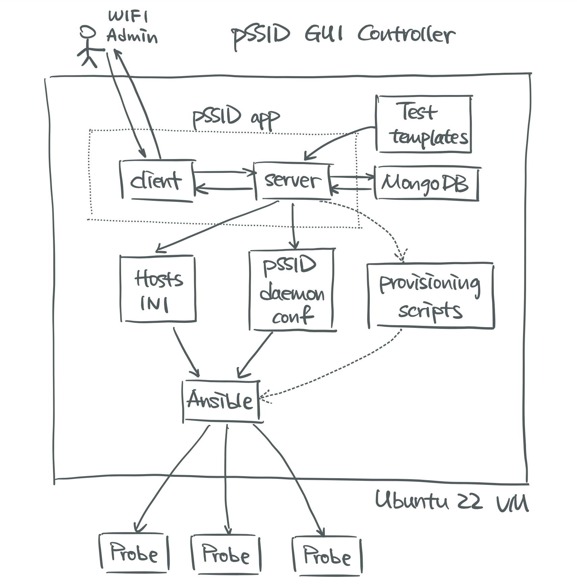
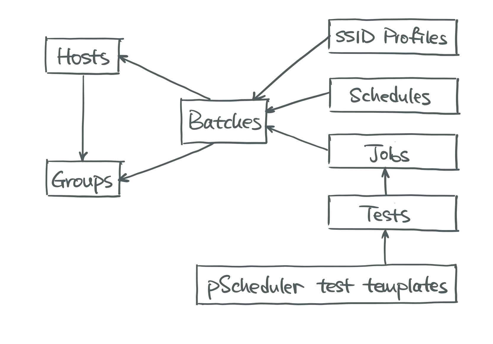

# pssid-gui2

Version 2.0 of the pSSID-GUI Web Application

## Installation
### Ansible
Follow the steps in this
[repository](https://github.com/UMNET-perfSONAR/ansible-playbook-pssid-GUI-deploy).

### Setting up certificates (temporarily)
Follow the steps in this [repository](https://github.com/FiloSottile/mkcert) to get mkcert installed on your local machine (not the VM!).

In your local machine, run
```
mkcert pssid-web-dev.miserver.it.umich.edu
```
** The certs will be saved in the same directory that you ran this command in.

You should have pssid-web-dev.miserver.it.umich.edu.pem and pssid-web-dev.miserver.it.umich.edu-key.pem generated.

Finally, copy over the certs to the VM, placing them in /pssid-gui2/certs/ folder. If the certs/ folder does not exist, please create one.

### Source Code
Clone this repository and run
```
docker-compose -f docker-compose.yml up -d
```
in the same directory. You may need `sudo` access to run docker compose.

---
## Important README Links in this Repository

[Steps to add fields to config file](https://github.com/UMNET-perfSONAR/pssid-gui2/blob/main/services/README.md)

[Ideas for future improvement](https://github.com/UMNET-perfSONAR/pssid-gui2/tree/main/services/client)

### Backend
[About Test Template Files](services/server/README.md)

[About the Backend Folders](https://github.com/UMNET-perfSONAR/pssid-gui2/tree/main/services/server/src/README.md)

[About Each Service File - In Server](https://github.com/UMNET-perfSONAR/pssid-gui2/tree/main/services/server/src/services/README.md)

### Frontend
[About each Frontend Directory](https://github.com/UMNET-perfSONAR/pssid-gui2/blob/main/services/client/src/README.md)

[About each Client Component](https://github.com/UMNET-perfSONAR/pssid-gui2/blob/main/services/client/src/components/README.md)

----
## pSSID GUI Web Application
### System Overview
The core application consists of three Docker containers, client, server, and MongoDB.
Users directly interact with the client container, which will in turn communicate with
the backend server and database containers. Test templates are files on disk that
define the rules for each test, i.e., what configuration fields should be provided
for each test type. Dynamics forms are then geneated on the frontend based on the
rules defined in the templates.

<p align="center">

</p>

The web application outputs two files, `hosts.ini` and `pssid_conf.json`. The latter
is the pSSID daemon config file described below,
which essentially contains the batches to be scheduled. The
former, `hosts.ini`, is an Ansible inventory containing the list of hosts and groups
defined on the GUI. They provide information about what to do (`pssid_conf.json`) on
which probes (`hosts.ini`). The provisioning scripts will use Ansible to copy the
daemon config file onto the probes defined in `hosts.ini`,
and pSSID daemon on each probe will run accordingly.

### Output pSSID Daemon Config File
The output configuration file is broken up into 7 components: hosts, host groups,
schedules, SSID profiles, tests, jobs, and batches, each corresponding to a page
on the GUI dashboard. See the breakdown below:

<p align="center">

</p>

At a high level, we use template files **on disk** to define a test. We then use tests
to define a job. Eventually, we use SSID profiles, schedules, and jobs to define a
batch and run batches, not raw tests, on the probes.

### Graphical User Interface
The web application has seven separate tabs, one for each component of the
configuration file.

Each tab has the ability to create, read, update, and delete its own data.
Each tab has the following:
* List of current objects in the MongoDB collection
  * inclduing a regex search bar to search through objects
* Add object form
* Edit/delete object form that appears after clicking on the name of an object

<p align="center">

</p>

## Troubleshooting
In case the service is not available, a quick way to restart it is to directly run
the `up.sh` script on the VM.

First check if there are any lingering Docker containers still up and running
```
docker ps
```

When the service runs correctly, there should be three containers associated with it.
```
pssid-gui2_server_1
pssid-gui2_mongo_1
pssid-gui2_client_1
```

If the service is down, some of them might be missing from the list and some of them
might still be running. Stop all lingering containers.
```
docker stop <container ID/name>
```

Then free up used resources to prepare for a restart
```
sudo docker system prune -af
```

Finally run the script to start the service
```
sh ~/up.sh
```
